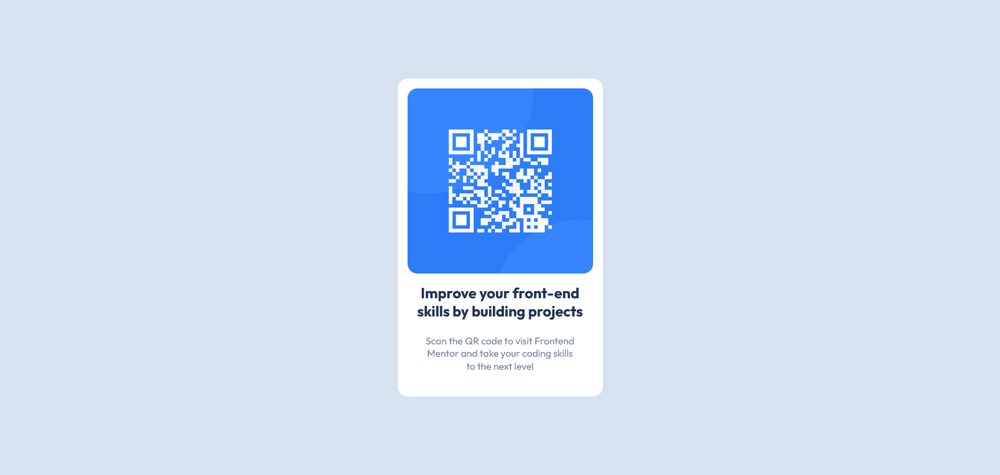

# Frontend Mentor - QR code component solution

This is a solution to the [QR code component challenge on Frontend Mentor](https://www.frontendmentor.io/challenges/qr-code-component-iux_sIO_H).

## Screenshot

## Links

- Solution URL: [github.com](https://github.com/Apollo-1101/QR-code-component/blob/main/index.html)
- Live Site URL: [github.com](https://apollo-1101.github.io/QR-code-component/)

## Built with

- HTML
- CSS
- CSS Grid

## Author

- Frontend Mentor - [@ApØllo]https://www.frontendmentor.io/profile/Apollo-1101)
